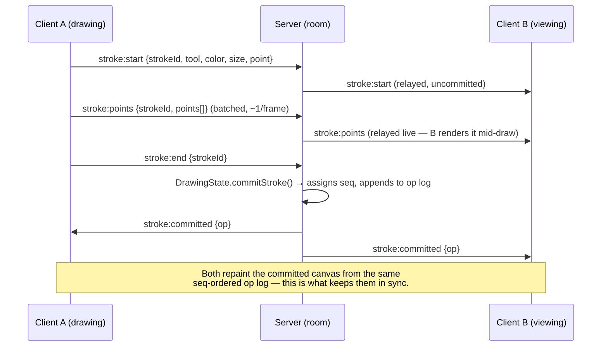

# Architecture

## Stack, and why

Plain JavaScript (no TypeScript, no build step) on both sides, HTML5 Canvas
on the client, native WebSockets (the `ws` package) on the server — no
Socket.io, no drawing library, no frontend framework, per the assignment's
constraints. Skipping a build step means the client's `.js` files load as
native ES modules directly in the browser; nothing to compile, nothing to
get out of sync with source.

## Data flow

The key property: **strokes stream to other clients while still in
progress** (start/points relayed immediately, uncommitted), and only become
part of the permanent, undo-able history at `stroke:end`, when the server
assigns the op its `seq`. Everything downstream of that (undo, redo,
conflict resolution, late-joiner sync) is defined purely in terms of the
`seq`-ordered op log — there is exactly one authoritative history, held by
the server, and every client is a read-through of it.

## WebSocket protocol

Full message set (see [`shared/protocol.js`](./shared/protocol.js) for the
canonical JSDoc shapes — it's imported by nothing at runtime, it exists so
both sides document the same contract in one place):

| Message | Direction | Payload | When |
|---|---|---|---|
| `stroke:start` | C→S→broadcast (excl. sender) | `{strokeId, tool, color, size, point}` | `pointerdown` |
| `stroke:points` | C→S→broadcast (excl. sender) | `{strokeId, points[]}` | once per animation frame while drawing |
| `stroke:end` | C→S | `{strokeId}` | `pointerup` / `pointercancel` |
| `stroke:cancel` | C→S→broadcast (all) | `{strokeId}` | Escape — discards, never committed |
| `stroke:committed` | S→broadcast (all, incl. sender) | `{op}` | server assigns `seq`, appends to log |
| `stroke:abort` | S→broadcast (all) | `{strokeId, reason}` | disconnect mid-stroke, or cancel |
| `undo:request` / `redo:request` | C→S | `{}` (intent only — no target seq) | Ctrl+Z / buttons |
| `undo:applied` / `redo:applied` | S→broadcast (all) | `{op}` (the full op, not just id) | server resolves the stack |
| `undo:noop` / `redo:noop` | S→sender | `{}` | stack was empty |
| `cursor:move` | C→S→broadcast (excl. sender) | `{x, y}` | throttled ~50ms |
| `state:sync` | S→C | `{userId, color, users[], opLog[]}` | right after connecting |
| `user:joined` / `user:left` | S→broadcast | `{user}` / `{userId}` | connect / disconnect |
| `ping` / `pong` | C→S / S→C | `{ts}` | client-initiated, every 15s |
| `error` | S→C | `{code, message}` | malformed input, rate limit |

**Batching**: `stroke:points` flushes once per `requestAnimationFrame` tick
instead of on every `pointermove` — a fast mouse can fire that event well
over 100 times/second, and there's no reason to send more than the
committed canvas can even render. A size cap forces an early flush if a
backgrounded tab throttles `requestAnimationFrame` and the buffer would
otherwise balloon. `cursor:move` is throttled to ~50ms (20fps) — a cursor
dot doesn't need frame-rate precision.

**"Client-side prediction"**, reframed: there's no server authority over the
drawing itself that could reject a user's own input, so nothing is actually
being predicted-and-corrected the way a game server would. What's really
happening is **optimistic local rendering with server-authoritative
sequencing** — your own strokes render instantly regardless of round-trip
latency, and the one real reconciliation point is `stroke:committed`, where
the server's assigned `seq` determines this stroke's final layering position
relative to whatever else committed around the same time.

## Global undo/redo

This is the part the assignment calls out as "the tricky part," so here's
the reasoning, not just the mechanism.

**Two possible readings of "works globally across all users":**
1. *Per-user stacks, globally visible* — each user can only undo their own
   strokes.
2. *One shared stack* — any user's undo removes the single most recent
   action, regardless of who drew it.

We implemented **(2)**. Reasoning: (1) is actually the easier design — each
client just filters by its own `userId` locally, no cross-client ordering
coordination needed at all. (2) is what genuinely requires a
server-authoritative, agreed-upon global order, which is why it reads as the
harder, more deliberate interpretation of "the tricky part." (See
[`server/drawing-state.js`](./server/drawing-state.js).)

**Mechanism:**
- Each room keeps one append-only op log: `{seq, id, userId, color, size,
  tool, points, undone}`. `seq` is assigned by the server only, on
  `stroke:end` → `stroke:committed` — never by a client.
- Undo/redo requests are **intent-only** (`{type: "undo:request"}`, no
  target `seq`). The server resolves "what's currently on top of the stack"
  itself, at the moment it processes the message. This is what makes two
  near-simultaneous undos from different users safe: Node processes
  WebSocket messages one at a time, so the second request simply observes
  whatever state the first one left behind. There's no window for a race,
  because there's nothing for the two requests to disagree about — neither
  one is asserting *which* op to touch.
- Undo flips the highest-`seq` non-undone op's `undone` flag to `true` and
  pushes its id onto a small redo stack. Redo pops that stack and flips the
  flag back — **in place**, at the op's original array position, so a
  redone stroke reappears at its original layering order rather than
  jumping on top of whatever was drawn after it was undone. This was a
  deliberate fork (re-insert at original position vs. re-append on top) —
  we chose original-position because it's the more literal "undo the undo,"
  and it's what falls out naturally from toggling a flag instead of moving
  array elements.
- A newly committed stroke clears the redo stack (standard editor
  semantics, just applied to a stack shared by everyone instead of one user).
- Empty-stack undo/redo replies with `undo:noop` / `redo:noop` so the UI can
  say "nothing to undo" instead of silently doing nothing.

**Edge cases this design handles, and how:**

| Case | Handling |
|---|---|
| Two users hit Ctrl+Z within milliseconds | No race — see "intent-only" above. Node's single-threaded, one-message-at-a-time processing is the only synchronization primitive needed. |
| Undo requested while a stroke is still in-progress | Impossible to target — undo only ever looks at the committed op log; an uncommitted stroke isn't in it. |
| Client disconnects mid-stroke | Server auto-commits the partial stroke if it has ≥2 points (real work), otherwise discards it — either way it broadcasts `stroke:abort`/`stroke:committed` so other clients don't keep a permanent ghost of an unfinished stroke on their live layer. See `finalizeOrDiscard` in `drawing-state.js` and the `ws.on("close", ...)` handler in `server.js`. |
| Redo-stack invalidation race | The check-and-clear happens synchronously inside `commitStroke`, with no `await` in between — there's no interleaving window even conceptually. |
| Undo of a stroke whose author has since disconnected | Still works — `color`/`userId` are stored **on the op itself** at commit time, never looked up from the live online-users list. |
| Duplicate `stroke:end` (e.g. a client retry after a flaky connection) | `commitStroke` deletes the stroke from `activeStrokes` before returning; a second call for the same id finds nothing and returns `null`, so it can't double-commit. |
| Local "cancel my current stroke" (Escape) | A distinct `stroke:cancel` message, not reused from `stroke:end` — `stroke:end` always commits (even a 1-point stroke becomes a "dot"), so cancel needed its own path that discards the stroke entirely and tells other clients to drop it from their live layer (their copy already received the `stroke:start`/`points`). |
| Unbounded op-log growth | Not solved — documented as a known limitation (README). A production version would compact old, non-undoable history or move to a real datastore. |

## Conflict resolution

Reframed correctly, there mostly isn't one to "resolve": strokes are
**additive paint operations**, not shared mutable state. Two users drawing
over the same pixels aren't editing the same value — they're each adding a
new layer of paint. The only real question is *what order* those layers
composite in, and that's answered deterministically: the server assigns
each committed stroke a monotonically increasing `seq`, and every client
repaints its committed canvas by iterating the op log in that exact order
(a painter's algorithm). Same ops, same order, every client — so overlapping
strokes always look identical everywhere, with no merge step required.

The one place this needed real design was **in-progress** strokes from
multiple users drawing at once — those render on a shared scratch ("live")
canvas with no defined z-order between different users' unfinished strokes.
That's intentional, not an oversight: the live layer is a preview only;
final layering is decided exclusively at commit time via `seq`.

## Performance decisions

- **Two-canvas layering**: a `committed` canvas (redrawn only when the op
  log actually changes — undo/redo/join/resize) and a `live` canvas
  (redrawn every animation frame, but *only* while at least one stroke is
  in progress — the render loop stops itself entirely when idle, so a quiet
  canvas costs zero CPU). See [`client/canvas.js`](./client/canvas.js).
- **Per-stroke bitmap baking**: a long-running stroke doesn't get redrawn
  from its first point every frame. Every ~200 points it gets baked into an
  offscreen `<canvas>` bitmap; each frame after that only draws that cached
  bitmap (O(1)) plus the small tail of points accumulated since (O(k)),
  instead of redrawing the whole path (O(n)) every single frame.
- **DPR-aware sizing**: both canvases size their backing store to
  `CSS size × devicePixelRatio` and use `setTransform` (not `scale`, so
  repeated resizes never compound) — crisp lines on high-DPI displays,
  redone on every resize.
- **Hand-rolled smoothing**: quadratic Bézier curves through the midpoints
  of consecutive sampled points, using each real point as the curve's
  control point. Keeps freehand strokes smooth despite relatively sparse,
  network-batched input.
- **Pointer Events, not separate mouse/touch handlers**: one code path
  handles mouse, touch, and stylus. `touch-action: none` in CSS stops the
  browser from treating a finger-drag as a page scroll; `pointercancel` is
  handled identically to `pointerup` so an OS gesture interrupting a touch
  (e.g. a notification pull-down) can't leave a stroke stuck "held down."
- **DOM cursors, not canvas cursors**: remote presence cursors are small
  absolutely-positioned `
`s (`pointer-events: none`), not something
  drawn into a canvas context. Keeps the live canvas's job narrowly scoped
  to strokes, and text/label rendering is strictly simpler in DOM than via
  canvas text metrics.
- **Tool registry**: `canvas.js` exposes tools as
  `{applyStyle(ctx, style), draw(ctx, points)}` entries in a lookup object.
  Brush and eraser are the two shipped entries; adding a shape tool (e.g.
  rectangle) is one new registry entry using `ctx.strokeRect(...)` on the
  stroke's first/last points — no renderer changes required. This is a
  deliberate extension point, not incidental structure.

## Scaling to ~1000 concurrent users

Reframing first: 1000 users in *one* shared canvas is a different (and
arguably undesirable-UX) problem from 1000 users spread across many rooms.
Because state here is already sharded per room, the realistic story is
horizontal-by-room, not vertical-within-a-room.

- **The real bottleneck is fan-out, not connection count.** A single Node
  process comfortably holds tens of thousands of idle WebSocket
  connections. What doesn't scale is broadcasting `stroke:points` to every
  other member of a *busy* room — that's O(N²) message volume for N
  simultaneously-drawing users. The practical lever is capping how many
  people can usefully draw in one room at once, not making a single room
  infinitely large.
- **Horizontal scale-out needs room-sharding + sticky routing.** Put a
  load balancer in front that routes all of a given room's WebSocket
  connections to the same backend instance (consistent hashing on
  `roomId`). That keeps this design's core correctness property — Node's
  single-threaded, one-message-at-a-time processing, which is what makes
  the undo/redo race-freedom argument above hold — true *within* a room
  without needing distributed locks.
- **Cross-instance broadcast** (for the rebalancing edge case where a room's
  members land on different instances anyway) needs a pub/sub backplane —
  Redis Pub/Sub, or the `@socket.io/redis-adapter` equivalent for `ws`.
- **`seq` assignment**, if a single room's traffic ever needs to span more
  than one process, would move from an in-memory counter to an atomic
  `INCR` in Redis.
- **Persistence** swaps the per-room JSON file for a real datastore
  (Postgres for the durable op log, or Redis as the hot store with periodic
  snapshotting).
- **Bandwidth**: compact point encoding (flat number arrays instead of
  `{x,y,t}` objects) and/or WebSocket `perMessageDeflate` compression trade
  CPU for bandwidth as message volume grows.
- **Static assets** move off the Node process entirely (served via a
  CDN/reverse proxy), so the process only ever handles WebSocket traffic.
- **Operational**: graceful shutdown that flushes each room's pending
  persistence write before an autoscaled instance terminates; monitor
  event-loop lag and per-room message rate as the concrete signal for when
  a room needs to be split or throttled.
